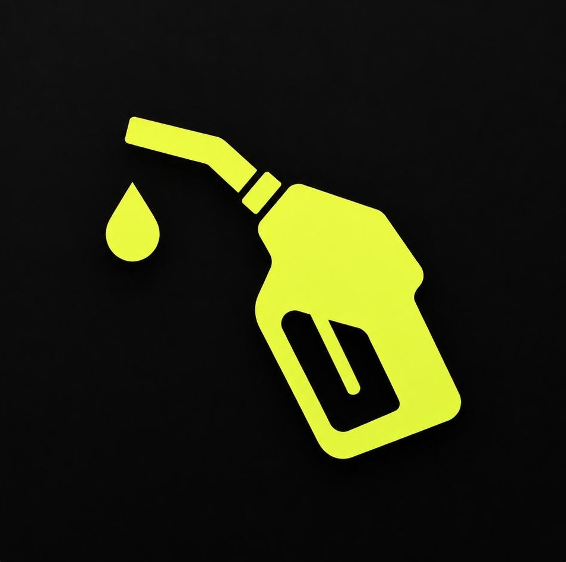

<div align="center">

  

  # Mileaged

  **The Simple, Private Vehicle Mileage & Fuel Efficiency Tracker**

  [](https://play.google.com/store/apps/details?id=com.silvereon.mileaged)
  [](https://flutter.dev)
  [](https://www.android.com)
  [](#-privacy-first)
  [](#-privacy-first)

  <p align="center">
    Track your vehicle's fuel efficiency, mileage, and refueling history with complete privacy.<br/>
    All data stays locally on your device. No tracking, no ads, no forced cloud accounts.
  </p>

  [Get it on Google Play](https://play.google.com/store/apps/details?id=com.silvereon.mileaged) • [Features](#-core-features) • [How It Works](#-how-it-works) • [Installation](#-getting-started)

</div>

---

## 📖 About Mileaged

**Mileaged** is a lightweight, offline-first vehicle mileage and fuel management app built with **Flutter**. Designed around privacy and simplicity, Mileaged allows vehicle owners, fleet managers, and privacy-conscious drivers to log fuel stops using the proven **Tank-to-Tank** method to calculate exact fuel consumption.

Whether you measure performance in **km/l** or **mpg**, Mileaged gives you full visibility over your fuel economy and expenses without compromising your personal data.

---

## 🚗 Core Features

### 🚘 Vehicle Management
- **Add Unlimited Vehicles**: Track multiple cars, motorcycles, or commercial vehicles in one place.
- **Custom Vehicle Photos**: Assign custom gallery images to personalize each vehicle profile.
- **Quick Switcher**: Seamlessly switch active vehicle contexts with a single tap.
- **Full Control**: Edit vehicle details or delete records anytime.

### ⛽ Mileage & Refueling Tracking (Tank-to-Tank Method)
- **Automatic Mileage Calculation**: Accurately computes fuel economy based on consecutive full tank refills.
- **Fuel Price & Cost Trends**: Log fuel prices and total cost per refuel to track expenditure over time.
- **Historical Insights**: View mean fuel efficiency, total fuel consumed, and overall distance logged per vehicle.

### 🎨 Customization & Theme Options
- **Multiple Accent Colors**: Personalize the app palette to fit your preference.
- **Dark Mode**: Native dark and light theme support for comfortable day and night usage.
- **Unit Flexibility**: Choose between Metric (`km/l`) and Imperial (`mpg`) measurement units.
- **Persistent Preferences**: Your custom settings are saved and preserved across app sessions.

### 💾 Data Ownership & Backup
- **100% Offline First**: Operates seamlessly without an active internet connection.
- **Local JSON Export / Import**: Easily export a complete backup file of your data or restore previous logs.
- **Optional Google Drive Sync**: Enable manual sync to Google Drive to back up data across your devices — strictly under your manual trigger.

---

## 🔒 Privacy First

Your data belongs exclusively to **you**:

| Guarantee | Details |
|---|---|
| 🚫 **No Personal Data Collection** | We do not collect, track, or record any identity or usage metrics. |
| 🚫 **No Ads & No Analytics** | Zero third-party ad SDKs, banners, or tracking scripts. |
| 🚫 **No Account Required** | Open the app and start logging immediately without signing up. |
| 🔒 **Local Sandbox Storage** | All records are stored securely in your app's private local database. |
| 🌐 **Controlled Connectivity** | Network permissions are only used if you manually trigger Google Drive backup. |

---

## 💡 How Tank-to-Tank Mileage Works

The **Tank-to-Tank** method is the gold standard for real-world fuel economy measurement:

1. **Fill Up**: Fill your vehicle tank to full capacity and record your odometer reading.
2. **Drive**: Drive normally until your next refueling stop.
3. **Refill & Log**: Fill the tank to full again. Enter your new odometer reading and the volume of fuel added.
4. **Instant Calculation**: Mileaged automatically calculates the distance driven divided by the fuel added, producing your exact mileage efficiency rating (`km/l` or `mpg`).

---

## ⚙️ Tech Stack & Dependencies

Built with modern Flutter standards and best practices:

- **Framework**: [Flutter SDK](https://flutter.dev) (Dart >= 3.0.0 < 4.0.0)
- **UI Architecture**: Material Design 3 with dynamic theme & color switching
- **State & Local Storage**: `shared_preferences` & custom JSON file management sandbox
- **Cloud Backup**: `google_sign_in`, `googleapis`, `extension_google_sign_in_as_googleapis_auth` (Google Drive v3)
- **Media & Assets**: `image_picker` for custom vehicle photos, `flutter_svg` for crisp vector iconography
- **App Icons**: Custom adaptive icons generated via `flutter_launcher_icons`

---

## 🛠️ Getting Started

### Prerequisites
- [Flutter SDK](https://docs.flutter.dev/get-started/install) (`>= 3.0.0`)
- [Dart SDK](https://dart.dev/get-sdk)
- Android Studio / VS Code with Flutter extension
- Android Device or Emulator running Android 8.0 (API Level 26) or higher

### Installation & Run

1. **Clone the Repository**:
   ```bash
   git clone https://github.com/silvereon-rs/Mileaged.git
   cd Mileaged
   ```

2. **Fetch Dependencies**:
   ```bash
   flutter pub get
   ```

3. **Run the Application**:
   ```bash
   flutter run
   ```

4. **Build APK for Release**:
   ```bash
   flutter build apk --release
   ```

---

## 📋 App Permissions

| Permission | Purpose |
|---|---|
| `READ_EXTERNAL_STORAGE` / `READ_MEDIA_IMAGES` | Select vehicle profile pictures from photo gallery |
| `INTERNET` | Optional Google Drive cloud backup & restore synchronization |

---

## 📱 Store Listing Details

- **Package Name**: `com.silvereon.mileaged`
- **Google Play Link**: [Mileaged on Google Play](https://play.google.com/store/apps/details?id=com.silvereon.mileaged)
- **Category**: Productivity / Lifestyle
- **Content Rating**: Everyone (3+)
- **Developer**: Silvereon

---

## 📄 License & Privacy Policy

- **Privacy Policy**: Read the full [Privacy Policy](PRIVACY_POLICY.md).
- **Communication Guidelines**: Refer to [Comunication.md](Comunication.md).

---

<div align="center">
  Crafted with ❤️ by <b>Silvereon</b>
</div>
